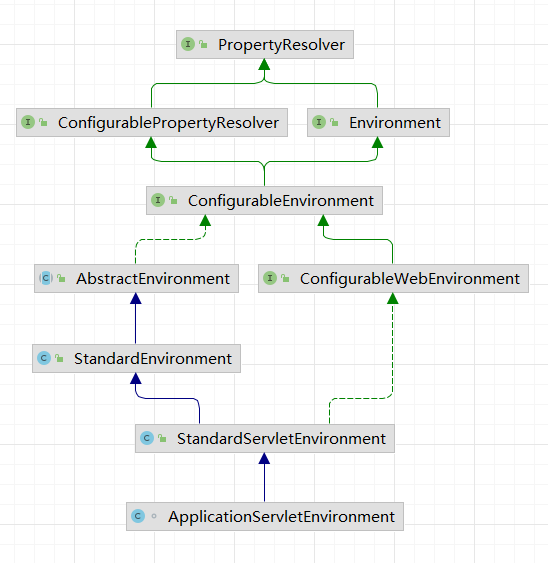

### springboot启动

原来使用web.xml初始化Spring

提供配置文件

```html
<context-param>
	<param-name>contextConfigLocation</param-name>
  <param-value>classpath:applicationContext.xml</param-value>
</context-param>
```

`<listener>`启动时去加载`<context-param>`里面的参数，启动spring容器

```html
web项目的入口在tomcat(不能用main方法new AnnotationConfigApplicationContext()初始化容器)
所以用listener用来初始化spring的context环境，上面的<context-param>提供配置文件
<listener>
	<listener-class>org.springframework.web.context.ContextLoaderListener</listener-class>
</listener>
```

配置servlet

```html
配置servlet，或使用@WebServlet注解(servlet2.6加入，tomcat7及以上支持)(websocket只能运行在tomcat8及以上)
<servlet>
	<servlet-name>spring mvc</servlet-name>
  <servlet-class>org.springframework.web.servlet.DispatcherServlet</servlet-class>
  <init-param>
  	<param-name>contextConfigLocation</param-name>
    <param-value>classpath:spring-mvc.xml</param-value>
  </init-param>
</servlet>
```

配置文件功能(包扫描 + bean声明)


`web.xml` 被 `WebApplicationInitializer` 替代

springboot中如何实现上述功能

1. `AnnotationConfigWebApplicationContext`完成context的初始化和bean注册
2. 使用`WebApplicationInitializer`完成`DispatcherServlet`注册


#### 手动注册 servlet, filter, listener

1. `@WebFilter + @ServletComponentScan (servlet3.0)`

2. `FilterRegistrationBean + @Bean`

3. `javax.servlet.ServletContainerInitializer`

   基于服务提供者接口（SPI）概念，因此你需要在你的`jar`包目录下添加`META-INF/services/javax.servlet.ServletContainerInitializer`文件，内容就是`ServletContainerInitializer`实现类的全限定名

   配合 `@HandleTypes` 注解，通过指定Class，容器会把所有的指定类的子类作为方法`onStartup` 的参数`Set<Class<?>> c`传递进来

4. `org.springframework.web.SpringServletContainerInitializer`

   实现 3，只有一个方法 onStartup

   4 负责实例化 `ServletContext` 并将其委托给任何用户定义的 5 实现。然后每个 5 负责执行初始化`ServletContext` 的实际工作

   通过检测 `META-INF/services/javax.servlet.ServletContainerInitializer` 文件

5. `org.springframework.web.WebApplicationInitializer `

   只有一个方法 onStartup，用来代替 web.xml

   此 SPI 的实现将由 4 自动检测，它本身由 Servlet 3.0 容器自动引导

   ```java
   public class MyWebAppInitializer implements WebApplicationInitializer {
    
       @Override
       public void onStartup(ServletContext container) {
           XmlWebApplicationContext appContext = new XmlWebApplicationContext();
           appContext.setConfigLocation("/WEB-INF/spring/dispatcher-config.xml");
   
           ServletRegistration.Dynamic dispatcher = container.addServlet("dispatcher", new DispatcherServlet(appContext));
           dispatcher.setLoadOnStartup(1);
           dispatcher.addMapping("/");
       }
   
   }
   ```

   

6. `org.springframework.boot.web.servlet.support.SpringBootServletInitializer`

   继承 5

   使用传统的WAR包的方式部署运行 `SpringApplication`

7. `org.springframework.boot.web.servlet.ServletContextInitializer`

   与 5 不同，实现此接口的类（并且不实现 5 ）不会被 4 检测到，因此**不会**被 Servlet 容器自动引导。
   该接口的设计方式与 3 类似，但其生命周期由 Spring 而不是 Servlet 容器管理。

   ```java
   // 项目在开发时，为了开发方便，可能使用的是内嵌的容器。而当部署到生成环境可能用的是war包的方式，部署到外部的容器中。这样代码必须同时兼容这两种方式
   @SpringBootApplication
   public class SpringBootLearnInitializer extends SpringBootServletInitializer {
   
       // 使用内嵌容器时，main方法入口在这里，启动初始化的某个时间段也启动了内嵌容器
       // 使用外部容器时，忽略 main 存在
       public static void main(String[] args) {
           SpringApplication.run(SpringBootLearnInitializer.class, args);
       }
   
       // 使用内嵌容器时，不会被调用。
       // 外部容器时，外部容器检测到 SpringServletContainerInitializer，然后又检测到继承自WebApplicationInitializer的，然后被调用了，初始化也开始了
       @Override
       protected SpringApplicationBuilder configure(SpringApplicationBuilder builder) {
           return builder.sources(SpringBootLearnInitializer.class);
       }
   }
   ```

   调用的地方：

   创建内置 tomcat 时，`factory.getWebServer(getSelfInitializer())`，传入了`servletContextInitializers`

   `TomcatStarter#onStartup`内嵌的 tomcat 不会以spi方式加载  7 ，而是用 `TomcatStarter` 的`onStartup`，间接启动 7 ，来达到 3 的效果

   具体使用：

   `DispatcherServletAutoConfiguration`配置生效后`DispatcherServletRegistrationBean`就交由spring的IOC容器管理了，因此`ServletContextInitializer`能够被拿到

   

https://zhuanlan.zhihu.com/p/144015252

https://zhuanlan.zhihu.com/p/301063931


#### springboot 配置文件

```text
配置文件位置(优先级逐渐降低)
file:./config
file:./
classpath:/config/
classpath:/
```

springboot 静态资源

```text
ResourceProperties 默认静态资源四个存放位置(优先级逐渐降低)

classpath:/META-INF/resources/
classpath:/resources/
classpath:/static/
classpath:/public/

如果配置文件里配置了
spring:
  mvc:
    static-path-pattern: /myStatic

以上四个会失效
```

SpringBoot配置属性加载优先级及顺序(优先级逐渐降低)

1. 在您的主目录（当 devtools 被激活，则为 ~/.spring-boot-devtools.properties ）中的 Devtools 全局设置属性。
2. 在测试中使用到的 @TestPropertySource 注解。
3. 在测试中使用到的 properties 属性，可以是 @SpringBootTest和用于测试应用程序某部分的测试注解。
4. **命令行参数 --server.port=8081。**
5. 来自 SPRING_APPLICATION_JSON 的属性（嵌入在环境变量或者系统属性【system propert】中的内联 JSON）。
6. ServletConfig 初始化参数。
7. ServletContext 初始化参数。
8. 来自 java:comp/env 的 JNDI 属性。
9. Java 系统属性（System.getProperties()）。
10. 操作系统环境变量。
11. 只有 random.* 属性的 RandomValuePropertySource。
12. **在已打包的 jar 外部的指定 profile 的应用属性文件（application-{profile}.properties 和 YAML 变量）。**
13. 在已打包的 jar 内部的指定 profile 的应用属性文件（application-{profile}.properties 和 YAML 变量）。
14. **在已打包的 jar 外部的应用属性文件（application.properties 和 YAML 变量）。**
15. 在已打包的 jar 内部的应用属性文件（application.properties 和 YAML 变量）。
16. **在 @Configuration 类上的 @PropertySource 注解。**
17. 默认属性（使用 SpringApplication.setDefaultProperties 指定）。


#### SpringBoot 启动


**构造函数**

SpringApplication 的构造函数读取 classpath下所有的 `spring.factories` 配置文件

- 配置应用程序启动前的初始化对象

  创建 `ApplicationContextInitializer` 接口的实现类

- 配置应用程序启动前的监听器 (7 个)

  创建 `ApplicationListener` 接口的实现类

**run**

```java
// SpringApplication.java

public ConfigurableApplicationContext run(String... args) {
    // new 一个StopWatch用于统计run启动过程花了多少时间
    StopWatch stopWatch = new StopWatch();
    // 开始计时
    stopWatch.start();
    ConfigurableApplicationContext context = null;
    // exceptionReporters集合用来存储异常报告器，用来报告SpringBoot启动过程的异常
    Collection<SpringBootExceptionReporter> exceptionReporters = new ArrayList<>();
    // 配置“java.awt.headless”属性，默认为ture
    // 其实是想设置该应用程序,即使没有检测到显示器,也允许其启动.对于服务器来说,是不需要显示器的,所以要这样设置.
    configureHeadlessProperty();
    // 【1】从 META-INF/spring.factories 配置文件中加载并创建 EventPublishingRunListener 对象，会触发构造函数 (将上面加载的监听器放入 Multicaster)
    // 该对象主要用来发布 SpringBoot 启动过程中内置的一些生命周期事件，标志每个不同启动阶段
    SpringApplicationRunListeners listeners = getRunListeners(args);
    // 启动 SpringApplicationRunListener 的监听，表示SpringApplication开始启动。
    // 通过 SimpleApplicationEventMulticaster 发布【ApplicationStartingEvent】事件
    listeners.starting();
    try {
        // 创建 ApplicationArguments 对象，封装了 args 参数
        ApplicationArguments applicationArguments = new DefaultApplicationArguments(args);
        // 【2】读取application.properties 或者 application.yml文件，准备环境变量(StandardServletEnvironment)，包括系统变量，环境变量，profile，命令行参数，默认变量，servlet相关配置变量，随机值
        // JNDI属性值，以及配置文件（比如application.properties）等，注意这些环境变量是有优先级的
        // 发布【ApplicationEnvironmentPreparedEvent】事件
        ConfigurableEnvironment environment = prepareEnvironment(listeners,
                applicationArguments);
        // 配置spring.beaninfo.ignore属性，默认为true，即跳过搜索BeanInfo classes.
        configureIgnoreBeanInfo(environment);
        // 【3】控制台打印SpringBoot的bannner标志
        Banner printedBanner = printBanner(environment);
        // 【4】根据不同类型创建不同类型的spring applicationcontext容器
        // 因为这里是servlet环境，所以创建的是AnnotationConfigServletWebServerApplicationContext 容器对象
        context = createApplicationContext();
        // 【5】从spring.factories配置文件中加载异常报告期实例，这里加载的是FailureAnalyzers
        // 注意 FailureAnalyzers 的构造器要传入 ConfigurableApplicationContext，因为要从 context 中获取 beanFactory 和 environment
        exceptionReporters = getSpringFactoriesInstances(
                SpringBootExceptionReporter.class,
                new Class[] { ConfigurableApplicationContext.class }, context); // ConfigurableApplicationContext是AnnotationConfigServletWebServerApplicationContext的父接口
        // 【6】为刚创建的 AnnotationConfigServletWebServerApplicationContext 容器对象做一些初始化工作，准备一些容器属性值等
        // 1）为 AnnotationConfigServletWebServerApplicationContext 的属性 AnnotatedBeanDefinitionReader 和 ClassPathBeanDefinitionScanner 设置 environgment 属性
        // 2）根据情况对 ApplicationContext 应用一些相关的后置处理，比如设置 resourceLoader 属性等
        // 3）在容器刷新前调用各个 ApplicationContextInitializer 的初始化方法，ApplicationContextInitializer 是在构建 SpringApplication 对象时从 spring.factories 中加载的
        // 4）发布【ApplicationContextInitializedEvent】事件，标志context容器被创建且已准备好
        // 5）从 context 容器中获取 beanFactory，并向 beanFactory 中注册一些单例 bean，比如applicationArguments，printedBanner
        // 6）将启动类加载到容器中，为自动装配奠定基础
        // 7）发布【ApplicationPreparedEvent】事件，标志Context容器已经准备完成
        prepareContext(context, environment, listeners, applicationArguments,
                printedBanner);
        // 【7】刷新容器，这一步至关重要，以后会在分析Spring源码时详细分析，主要做了以下工作：
        // 1）在context刷新前做一些准备工作，比如初始化一些属性设置，属性合法性校验和保存容器中的一些早期事件等；
        // 2）让子类刷新其内部 bean factory,注意 SpringBoot 和 Spring 启动的情况执行逻辑不一样
        // 3）对 bean factory 进行配置，比如配置 bean factory 的类加载器，后置处理器等
        // 4）完成 bean factory 的准备工作后，此时执行一些后置处理逻辑，子类通过重写这个方法来在 BeanFactory 创建并预准备完成以后做进一步的设置
        // 在这一步，所有的 bean definitions 将会被加载，但此时bean还不会被实例化
        // 5）执行 BeanFactoryPostProcessor 的方法即调用 bean factory 的后置处理器：
        // BeanDefinitionRegistryPostProcessor（触发时机：bean定义注册之前）和BeanFactoryPostProcessor（触发时机：bean定义注册之后bean实例化之前）
        // 6）注册(不执行)bean的后置处理器 BeanPostProcessor，注意不同接口类型的 BeanPostProcessor；在Bean创建前后的执行时机是不一样的
        // 7）初始化国际化 MessageSource 相关的组件，比如消息绑定，消息解析等
        // 8）初始化事件发布器，如果 bean factory 没有包含事件发布器，那么new一个SimpleApplicationEventMulticaster 发布器对象并注册到 bean factory中
        // 9）AbstractApplicationContext 定义了一个模板方法 onRefresh，留给子类覆写，比如ServletWebServerApplicationContext 覆写了该方法来创建内嵌的tomcat容器
        // 10）注册实现了 ApplicationListener 接口的监听器，之前已经有了事件发布器，此时就可以派发一些 early application events
        // 11）完成容器 bean factory 的初始化，并初始化所有剩余的单例bean。这一步非常重要，一些bean postprocessor 会在这里调用。
        // 12）完成容器的刷新工作，并且调用生命周期处理器的 onRefresh() 方法，并且发布 ContextRefreshedEvent 事件
        refreshContext(context);
        // 【8】执行刷新容器后的后置处理逻辑，注意这里为空方法
        afterRefresh(context, applicationArguments);
        // 停止stopWatch计时
        stopWatch.stop();
        // 打印日志
        if (this.logStartupInfo) {
            new StartupInfoLogger(this.mainApplicationClass)
                    .logStarted(getApplicationLog(), stopWatch);
        }
        // 》》》》》发布【ApplicationStartedEvent】事件，标志spring容器已经刷新，此时所有的bean实例都已经加载完毕
        listeners.started(context);
        // 【9】调用ApplicationRunner和CommandLineRunner的run方法，实现spring容器启动后需要做的一些东西比如加载一些业务数据等
        callRunners(context, applicationArguments);
    }
    // 【10】若启动过程中抛出异常，此时用FailureAnalyzers来报告异常
    // 并》》》》》发布【ApplicationFailedEvent】事件，标志SpringBoot启动失败
    catch (Throwable ex) {
        handleRunFailure(context, ex, exceptionReporters, listeners);
        throw new IllegalStateException(ex);
    }

    try {
        // 》》》》》发布【ApplicationReadyEvent】事件，标志SpringApplication已经正在运行即已经成功启动，可以接收服务请求了。
        listeners.running(context);
    }
    // 若出现异常，此时仅仅报告异常，而不会发布任何事件
    catch (Throwable ex) {
        handleRunFailure(context, ex, exceptionReporters, null);
        throw new IllegalStateException(ex);
    }
    // 【11】最终返回容器
    return context;
}
```

1. 配置属性

2. 获取监听器，发布应用开始启动事件

3. 初始化输入参数

4. 配置环境，输出banner

   共有 4 中实现方式

   - StandardEnvironment：普通程序
   - StandardServletEnvironment：web 程序
   - MockEnvironment：测试程序
   - StandardReactiveWebEnvironment：响应式 web

   TODO 配置文件 application.properties 读取

5. 创建上下文

6. 预处理上下文

   `applyInitializers` 方法会将三个默认的内部类加入 `DefaultListableBeanFactory`

   这三个类是后置处理器 (`AbstractApplicationContext#invokeBeanFactoryPostProcessors`)

   ```
   //设置配置警告
   ConfigurationWarningsApplicationContextInitializer$ConfigurationWarningsPostProcessor
   SharedMetadataReaderFactoryContextInitializer$CachingMetadataReaderFactoryPostProcessor
   ConfigFileApplicationListener$PropertySourceOrderingPostProcessor
   ```

   

7. 刷新上下文

8. 再刷新上下文

9. 发布应用已经启动事件

10. 发布应用启动完成事件


**自动装配**

- prepareContext

  将启动类信息包装成 `AnnotatedGenericBeanDefinition `，添加到容器的 `beanDefinitionMap` 中

- refreshContext ->  `AbstractApplicationContext#refresh` -> `invokeBeanFactoryPostProcessors`

  会拿到 `ConfigurationClassPostProcessor`  (在 `AnnotationConfigServletWebServerApplicationContext `构造函数中注册进去)

  `ConfigurationClassParser#doProcessConfigurationClass` 进行扫描

  `ConfigurationClassParser.DeferredImportSelectorGroupingHandler#processGroupImports` 读取 spring.factories 中的类


**环境配置**

`SpringApplication#prepareEnvironment`



- `getOrCreateEnvironment` 创建一个 `ApplicationServletEnvironment`

  构造函数中会加入四个环境`servletConfigInitParams, servletContextInitParams, systemProperties, systemEnvironment`

- `configureEnvironment` ：判断`SpringBootApplication`是否指定了默认配置，加载默认的命令行配置

- 发布 `ApplicationEnvironmentPreparedEvent` 事件，加载配置文件 (`application.properties`)

  `ConfigFileApplicationListener.Loader#loadWithFilteredProperties` 区分 `profile`

  `ConfigFileApplicationListener.Loader#addToLoaded` 将配置放入 `Map`

  2.4 之后的版本改成 `ConfigDataEnvironmentPostProcessor` 加载配置文件


1. 从`spring.factories`配置文件中**加载`EventPublishingRunListener`对象**，该对象拥有`SimpleApplicationEventMulticaster`属性，即在SpringBoot启动过程的不同阶段用来发布内置的生命周期事件;
2. **准备环境变量**，包括系统变量，环境变量，命令行参数，默认变量，`servlet`相关配置变量，随机值以及配置文件（比如`application.properties`）等;
3. 控制台**打印SpringBoot的`bannner`标志**；
4. **根据不同类型环境创建不同类型的`applicationcontext`容器**，因为这里是`servlet`环境，所以创建的是`AnnotationConfigServletWebServerApplicationContext`容器对象；
5. 从`spring.factories`配置文件中**加载`FailureAnalyzers`对象**,用来报告SpringBoot启动过程中的异常；
6. **为刚创建的容器对象做一些初始化工作**，准备一些容器属性值等，对`ApplicationContext`应用一些相关的后置处理和调用各个`ApplicationContextInitializer`的初始化方法来执行一些初始化逻辑等；
7. **刷新容器**，这一步至关重要。比如调用`bean factory`的后置处理器，注册`BeanPostProcessor`后置处理器，初始化事件发布器且发布事件，初始化剩下的单例`bean`和SpringBoot创建内嵌的`Tomcat`服务器等等重要且复杂的逻辑都在这里实现，主要步骤可见代码的注释，关于这里的逻辑会在以后的spring源码分析专题详细分析；
8. **执行刷新容器后的后置处理逻辑**，注意这里为空方法；
9. **调用`ApplicationRunner`和`CommandLineRunner`的run方法**，我们实现这两个接口可以在spring容器启动后需要的一些东西比如加载一些业务数据等;
10. **报告启动异常**，即若启动过程中抛出异常，此时用`FailureAnalyzers`来报告异常;
11. 最终**返回容器对象**，这里调用方法没有声明对象来接收。


#### tomcat 的启动 

- createApplicationContext

  ```java
  // java8 lambda 表达式 ApplicationContextFactory
  ApplicationContextFactory DEFAULT = (webApplicationType) -> {
  	try {
  		switch (webApplicationType) {
  		case SERVLET:
  			return new AnnotationConfigServletWebServerApplicationContext();
  		case REACTIVE:
  			return new AnnotationConfigReactiveWebServerApplicationContext();
  		default:
  			return new AnnotationConfigApplicationContext();
  		}
  	}
  	catch (Exception ex) {
  		throw new IllegalStateException("Unable create a default ApplicationContext instance, "
  				+ "you may need a custom ApplicationContextFactory", ex);
  	}
  };
  ```

  


- refreshContext 

  就是 spring 中的 context 的创建过程 (`AbstractApplicationContext#refresh`)，其中  `onRefresh` 方法交给子类 (`ServletWebServerApplicationContext`) 实现，这里通过工厂创建了 tomcat 容器 (`TomcatServletWebServerFactory#getWebServer`)

  - 创建连接器 (Connector)
  - 添加容器 (Container, engine)

  


#### @ConditionOnXxx 原理

`DefaultListableBeanFactory#getBeanNamesIterator`

- 在spring ioc的过程中，优先解析`@Component，@Service，@Controller`注解的类。其次解析配置类，也就是`@Configuration`标注的类。最后开始解析配置类中定义的 bean。
- 当执行到配置类解析的时候，`@Component，@Service，@Controller ,@Configuration`标注的类已经全部被解析，所以这些`BeanDifinition`已经被同步。
- 如果两个Bean都是配置类中Bean，所以此时配置类的解析无法保证先后顺序，就会出现不生效的情况。

```java
@Configuration
public class Config1 {
	// 这里可能会因为顺序导致不生效
    @Bean
    @ConditionalOnBean(Bean2.class)
    public Bean1 bean1() {
        return new Bean1();
    }
}

@Configuration
public class Config2 {

    @Bean
    public Bean2 bean2(){
        return new Bean2();
    }
}
```


