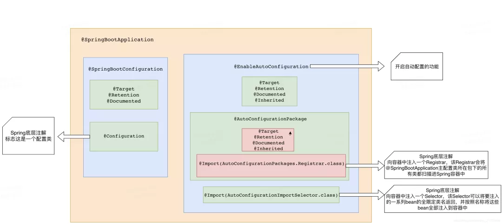
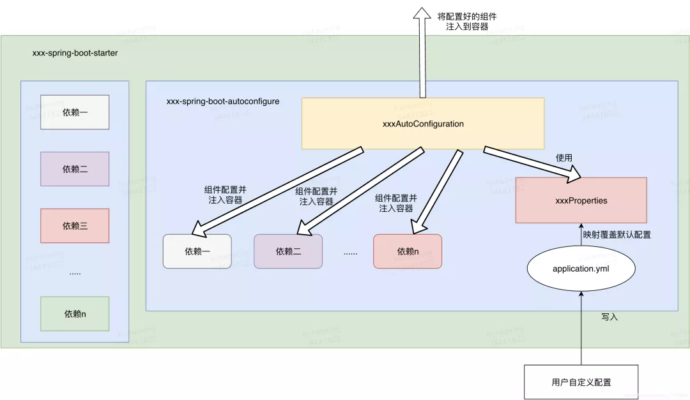

### SpringBoot Starter


自动配置

- 相关组件自动导入
- 相关组件自动配置


#### 自动配置原理

**自动配置类的获取与注入**

@SpringBootApplication



```java
@SpringBootConfiguration
@EnableAutoConfiguration
@ComponentScan(excludeFilters = { @Filter(type = FilterType.CUSTOM, classes = TypeExcludeFilter.class),
		@Filter(type = FilterType.CUSTOM, classes = AutoConfigurationExcludeFilter.class) })
public @interface SpringBootApplication {}


@SpringBootConfiguration // 标志这是一个配置类
@EnableAutoConfiguration // 开启自动配置功能
  @AutoConfigurationPackage
    @Import(AutoConfigurationPackages.Registrar.class) // 导入 Regsitrar，扫描主配置类所在包下的类注入Spring容器
  @Import(AutoConfigurationImportSelector.class) // 导入 Selector，返回将要注入的一系列bean的全限定类名
```

AutoConfigurationImportSelector

- AutoConfigurationMetadataLoader#loadMetadata() 获取对自动装配类的过滤条件，加速容器启动

  从 META-INF/spring-autoconfigure-metadata.properties 中获取所有的过滤条件 (自动配置类的全限定名.过滤条件 = xxx)

  spring.factories 中存放SpringBoot官方为我们提供的所有自动配置类的候选列表

- getAutoConfigurationEntry 获取需要注入的类的全限定类名


1. SpringBoot在启动的时候从类路径下的 META-INF/spring.factories 中获取 EnableAutoConfiguration 指定的所有自动配置类的全限定类名

2. 将这些自动配置类导入容器 ， 自动配置类就生效 ， 帮我们进行自动配置工作；

3. 整个J2EE的整体解决方案和自动配置都在 spring-boot-autoconfigure 的jar包中；

4. 它会给容器中导入非常多的自动配置类 （xxxAutoConfiguration）, 就是给容器中导入这个场景需要的所有组件 ， 并配置好这些组件 ；

5. 有了自动配置类 ， 免去了我们手动编写配置注入功能组件等的工作；


**自动配置的过程**

自动配置类被注入到容器当中后，会帮我们进行组件的自动配置和自动注入的工作

配置文件 POJO类 直接通过 `@ConfigurationProperties` 注解产生关联，通过配合`@EnableConfigurationProperties` 注解，就可以自动将与配置文件绑定好的这个类注入到容器中供我们使用。

**自动配置类的工作过程 ：**

- 首先容器会根据当前不同的条件判断，决定这个配置类是否生效！

- 一但这个配置类生效；这个配置类就会给容器中添加相应组件；

- 这些组件的属性是从对应的 properties 类中获取的，这些类里面的每一个属性又是和配置文件绑定的；

- 所有在配置文件中能配置的属性都是在 xxxxProperties 类中封装着，配置文件可以配置什么内容，可以参照该前缀对应的属性类中的属性字段

  xxxxAutoConfiguration：自动配置类；给容器中添加组件
  xxxxProperties：封装配置文件中相关属性；**

自动配置类必须在一定的条件下才能生效

| @Conditional 扩展注解           | 作用（判断是否满足当前条件）                     |
| ------------------------------- | ------------------------------------------------ |
| @ConditionalOnNotWebApplication | 当前不是web环境                                  |
| @ConditionalOnWebApplication    | 当前是web环境                                    |
| @ConditionalOnResource          | 类路径下是否有指定资源文件                       |
| @ConditionalOnExpression        | 满足SpEL表达式指定                               |
| @ConditionalOnMissingBean       | 容器中不存在指定的Bean                           |
| @ConditionalOnBean              | 容器中是否存在指定的Bean                         |
| @ConditionalOnSingleCandidate   | 容器中只有一个指定的Bean，或者这个Bean是首选Bean |
| @ConditionalOnJava              | 系统的java版本是否符合要求                       |
| @ConditionalOnMissingClass      | 系统中没有指定的类                               |
| @ConditionalOnClass             | 系统中有指定的类                                 |
| @ConditionalOnProperty          | 系统中指定的属性是否有指定的值                   |


#### 自定义场景启动器

- **xxxAutoConfiguration**：自动配置类，对某个场景下需要使用到的一些组件进行自动注入，并利用xxxProperties 类来进行组件相关配置

- **xxxProperties**：某个场景下所有可配置属性的集成，在配置文件中配置可以进行属性值的覆盖

按照SpringBoot官方的定义，Starer的作用就是**依赖聚合**，因此直接在 starter 内部去进行代码实现是不符合规定的，starter 应该只起到依赖导入的作用，而具体的代码实现应该去交给其他模块来实现，然后在 starter 中去引用该模块即可




1. xxxAutoConfiguration 的实现

   autoconfigure 模块中最重要的就是自动配置类的编写，它为我们实现组件的自动配置与自动注入。
   在编写自动配置类的时候，我们应该要考虑向容器中注入什么组件，什么条件下注入，如何去配置它。

2. xxxProperties的实现

   这是跟配置文件相绑定的类，里边的属性就是我们可以在配置文件中配置的内容，然后通过@ConfigurationProperties 将其与配置文件绑定

3. 配置spring.factories文件

   在resource目录下新建META-INF文件夹，在文件夹下新建 spring.factories 文件，并添加写好的xxxAutoConfiguration 类：

4. Starter模块开发
   starter 模块中只进行依赖导入，在 pom 文件中添加对 autoconfigure 模块的依赖，并添加一些其他必要的依赖项

   1. 新建一个只有pom的starter工程，引入写好的自动配置模块。

   2. 自动配置模块配置 spring.factories 文件。

   3. 具体实现自动配置逻辑。

这两个模块都开发完成之后，通过mvn install命令或者deploy命令将包发布到本地或者中央仓库，即可直接在其他项目中引用自定义的starter模块了


### SPI

service provider interface

1. 制定统一的规范（比如 java.sql.Driver）

2. 服务提供商提供这个规范具体的实现，在自己jar包的META-INF/services/目录里创建一个以服务接口命名的文件，内容是实现类的全命名（比如：com.mysql.jdbc.Driver）。

3. 平台引入外部模块的时候，就能通过该jar包META-INF/services/目录下的配置文件找到该规范具体的实现类名，然后装载实例化，完成该模块的注入。

这个机制最大的优点就是无须在代码里指定，进而避免了代码污染，实现了模块的可拔插。

```
new SpringApplication(primarySources).run(args);

setInitializers((Collection) getSpringFactoriesInstances(ApplicationContextInitializer.class));
  1. 加载类的全限定名列表。
  2. 根据类名通过反射实例化

SpringFactoriesLoader.loadFactoryNames(type, classLoader)
  获取类的全限定名
String factoryClassName = factoryClass.getName();
  1. 执行loadSpringFactories，这里只传入了类加载器，肯定是要获取全部配置
  2. getOrDefault，获取指定接口的实现类名称列表，如果没有则返回一个空列表
loadSpringFactories(classLoader).getOrDefault(factoryClassName, Collections.emptyList());

loadSpringFactories
  先检查缓存
  获取类路径下所有的 META-INF/spring.factories 文件，把加载的配置转换成 Map<String, List<String>>

List<T> instances = createSpringFactoriesInstances(type, parameterTypes, classLoader, args, names);
  将上面拿到的类名进行实例化

setListeners((Collection) getSpringFactoriesInstances(ApplicationListener.class));
```

